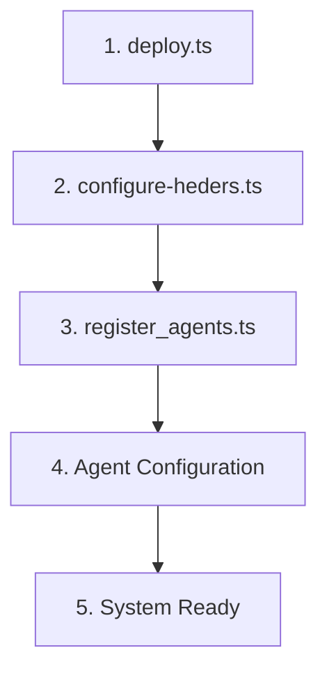
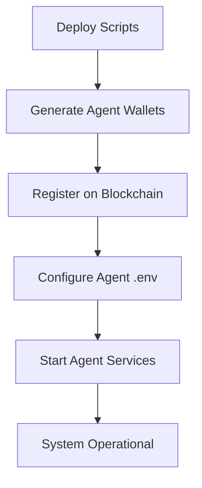

# Synthia Deployment Scripts

This directory contains essential **Hardhat scripts** for deploying, configuring, and managing the Synthia multi-agent reputation system on the **Hedera blockchain**. These scripts automate the complex process of setting up the entire ecosystem, from smart contract deployment to agent registration.

## Available Scripts

### 1. **deploy.ts** - Smart Contract Deployment
### 2. **configure-heders.ts** - Hedera Services Configuration
### 3. **register_agents.ts** - Multi-Agent Registration

---

## Deployment Workflow

The scripts follow a **specific sequence** that must be executed in order:



---

## Script Details

### 1. **deploy.ts** - Smart Contract Deployment

**Purpose**: Deploys both Synthia and SynthiaNFT contracts to the blockchain

#### What It Accomplishes

**Primary Deployments**
- **Synthia Contract**: Main reputation scoring and multi-agent coordination contract
- **SynthiaNFT Contract**: Soulbound reputation badge system (deployed internally by Synthia)
- **Role Initialization**: Sets up the deployer as the initial orchestrator agent

**Contract Integration**
- **NFT Contract Linking**: Automatically connects the NFT contract to the main contract
- **Permission Setup**: Grants `ORCHESTRATOR_ROLE` to the deployer
- **Initial State**: Establishes baseline contract state and counters

**Verification Steps**
- **Agent Count**: Verifies orchestrator registration (should be 1)
- **Contract Linking**: Confirms NFT contract integration
- **Role Validation**: Checks proper role assignment

#### Key Features

```typescript
// Deploys with orchestrator (deployer as initial orchestrator)
const synthia = await Synthia.deploy(deployer.address);

// Automatic NFT deployment and linking
const synthiaNFTAddress = await synthia.synthiaNFT();

// Comprehensive verification
console.log("Total agents registered:", await synthia.totalAgentsRegistered());
```

#### Output Information

- Contract addresses for both Synthia and SynthiaNFT
- Account balance and deployment costs
- Initial system state verification
- Next steps guidance

#### Execution Time
- **~30-60 seconds** (including verification)
- **Cost**: ~$0.01-0.05 (depending on gas prices)

---

### 2. **configure-heders.ts** - Hedera Services Integration

**Purpose**: Configures the deployed Synthia contract with **Hedera Consensus Service (HCS)** and **Hedera Token Service (HTS)**

#### What It Accomplishes

**HCS Integration**
- **Audit Topic Setup**: Configures immutable audit trail topic for reputation analyses
- **Topic Conversion**: Converts Hedera topic ID (`0.0.xxx`) to bytes32 format
- **Audit Logging**: Enables tamper-proof transaction logging

**HTS Integration**
- **Token Address Conversion**: Converts HTS token ID to EVM-compatible address
- **Reputation Token**: Links external reputation or reward tokens
- **Token Validation**: Verifies proper token configuration

**Configuration Verification**
- **Settings Validation**: Confirms HCS topic and HTS token are properly set
- **Contract State**: Verifies configuration persistence
- **Integration Testing**: Ensures services are operational

#### Key Features

```typescript
// HCS Topic Configuration
const topicBytes32 = ethers.zeroPadValue(ethers.toBeHex(topicNum), 32);
await Synthia.setHCSAuditTopic(topicBytes32);

// HTS Token Configuration
const tokenAddress = ethers.getAddress("0x" + shard.toString(16).padStart(8, "0") + ...);
await Synthia.setHTSReputationToken(tokenAddress);
```

#### Required Inputs

**Before Running**
- Deployed Synthia contract address
- HCS topic ID (from Hedera portal)
- HTS token ID (optional, for reputation rewards)

**Configuration Process**
1. **Topic Setup**: Convert and set HCS audit topic
2. **Token Setup**: Convert and set HTS reputation token
3. **Verification**: Confirm both services are configured
4. **Summary**: Display configuration details

#### Execution Time
- **~15-30 seconds** (including confirmations)
- **Cost**: ~$0.005-0.02 (2 transactions)

---

### 3. **register_agents.ts** - Multi-Agent Registration

**Purpose**: Registers **agent EVM addresses** with their respective roles in the Synthia contract

#### What It Accomplishes

**Agent Wallet Generation**
- **Random Wallet Creation**: Generates secure EVM wallets for each agent type
- **Private Key Management**: Outputs private keys for agent configuration
- **Address Documentation**: Provides addresses for environment variable setup

**Role-Based Registration**
- **Analyzer Agent**: Registers wallet analyzer with `ANALYZER_ROLE`
- **Blockchain Agent**: Registers blockchain agent with `BLOCKCHAIN_ROLE`
- **Role Validation**: Confirms proper role assignment

**Multi-Agent Setup**
- **Permission Granting**: Gives agents permission to interact with smart contracts
- **Role Verification**: Confirms each agent has appropriate permissions
- **System Integration**: Prepares system for multi-agent operation

#### Key Features

```typescript
// Generate secure agent wallets
const analyzerWallet = ethers.Wallet.createRandom();
const blockchainWallet = ethers.Wallet.createRandom();

// Register with specific roles
await Synthia.registerAgent(analyzerWallet.address, ANALYZER_ROLE);
await Synthia.registerAgent(blockchainWallet.address, BLOCKCHAIN_ROLE);
```

#### Agent Role Mapping

| Agent Type | Contract Role | Purpose | Permissions |
|------------|---------------|---------|-------------|
| **Wallet Analyzer** | `ANALYZER_ROLE` | Score computation & MeTTa reasoning | Submit scores, apply reasoning rules |
| **Blockchain Agent** | `BLOCKCHAIN_ROLE` | On-chain execution & HCS logging | Execute contracts, log to HCS |

#### Required Inputs

**Before Running**
- Deployed Synthia contract address
- Orchestrator permissions (from deploy.ts)

**Generated Outputs**
- Analyzer agent EVM address and private key
- Blockchain agent EVM address and private key
- Role registration confirmations
- Agent count verification

#### Execution Time
- **~30-45 seconds** (including 2 registrations)
- **Cost**: ~$0.01-0.03 (2 transactions)

---

## Complete Deployment Process

### Step-by-Step Execution

#### **Phase 1: Smart Contract Deployment**
```bash
# 1. Deploy contracts
npx hardhat run scripts/deploy.ts --network testnet

# Output:
# - Synthia Contract: 0x88FF715f1c23C2061133994cFd58c1E35A05beA2
# - SynthiaNFT Contract: 0x1e3D3fAcFaf416f0b0C038CC402eC36f06B064EF
```

#### **Phase 2: Hedera Services Configuration**
```bash
# 2. Configure HCS and HTS
npx hardhat run scripts/configure-heders.ts --network testnet

# Requires:
# - HCS Topic ID: 0.0.7100561
# - HTS Token ID: 0.0.7100548 (optional)
```

#### **Phase 3: Agent Registration**
```bash
# 3. Register agent addresses
npx hardhat run scripts/register_agents.ts --network testnet

# Output:
# - Analyzer Address: 0x3b4D391c2e1DE66CAeA6dEDa6A51E4a5180Bd3F7
# - Blockchain Address: 0x509773c61012620fCBb8bED0BccAE44f1A93AD0C
# - Private Keys: (save securely for agent configuration)
```

#### **Phase 4: Agent Configuration**
```bash
# 4. Update environment files
cp ../synthia-agents/.env.example ../synthia-agents/.env
# Add generated addresses and private keys to .env

# 5. Start agent system
cd ../synthia-agents
python agents/wallet_analyzer.py
python agents/blockchain_agent.py
python agents/orchestrator.py
```

### Environment Variable Updates

**After Agent Registration**
```env
# Agent EVM Configuration
ANALYZER_EVM_PRIVATE_KEY=0x96....c8
BLOCKCHAIN_EVM_PRIVATE_KEY=0x3....9e

# Contract Addresses
SYNTHIA_CONTRACT_ADDRESS=0x88FF715f1c23C2061133994cFd58c1E35A05beA2
SYNTHIA_NFT_ADDRESS=0x1e3D3fAcFaf416f0b0C038CC402eC36f06B064EF
```

---

## Security Considerations

### Private Key Management
- **Secure Storage**: Agent private keys must be stored securely
- **Environment Variables**: Never commit private keys to version control
- **Hardware Wallets**: Consider hardware wallets for production

### Access Control
- **Role Verification**: Scripts verify proper role assignment
- **Transaction Confirmation**: All transactions wait for confirmation
- **Error Handling**: Comprehensive error handling and validation

### Network Safety
- **Testnet First**: Always test on testnet before mainnet deployment
- **Gas Monitoring**: Scripts monitor and report gas usage
- **Transaction Validation**: Verify all transactions succeed

---

## Troubleshooting

### Common Issues

**1. Insufficient Balance**
```bash
# Check account balance before deployment
npx hardhat run scripts/deploy.ts --network testnet
# Look for: "Account balance: 1000000000000000000"
```

**2. Contract Already Deployed**
```bash
# Update contract addresses in configure-heders.ts and register_agents.ts
const SYNTHIA_CONTRACT_ADDRESS = "0x_your_deployed_address";
```

**3. Agent Registration Failed**
```bash
# Check if orchestrator role is properly assigned
# Ensure running from account with ORCHESTRATOR_ROLE
```

### Verification Commands

```bash
# Check contract deployment
npx hardhat run scripts/deploy.ts --network testnet

# Verify Hedera configuration
npx hardhat run scripts/configure-heders.ts --network testnet

# Confirm agent registration
npx hardhat run scripts/register_agents.ts --network testnet
```

---

## Cost Analysis

### **Testnet Costs** (Approximate)
- **Contract Deployment**: $0.02-0.05
- **HCS/HTS Configuration**: $0.01-0.02
- **Agent Registration**: $0.01-0.03
- **Total Setup**: ~$0.04-0.10

### **Mainnet Costs** (Estimated)
- **Contract Deployment**: $2-5
- **HCS/HTS Configuration**: $1-2
- **Agent Registration**: $1-2
- **Total Setup**: ~$4-9

---

## Why These Scripts Are Essential

### **1. Automated Complexity**
- **Multi-Step Process**: 15+ manual steps automated into 3 scripts
- **Error Reduction**: Eliminates human error in configuration
- **Consistency**: Ensures identical setup across environments

### **2. Security & Validation**
- **Input Validation**: Comprehensive parameter checking
- **Transaction Verification**: Confirms all operations succeed
- **State Validation**: Verifies final system state

### **3. Developer Experience**
- **Clear Output**: Detailed logging and progress tracking
- **Next Steps**: Guidance for post-deployment configuration
- **Error Messages**: Helpful debugging information

### **4. Production Readiness**
- **Environment Agnostic**: Works on testnet and mainnet
- **Configurable**: Easy customization for different networks
- **Documented**: Complete setup and troubleshooting guides

---

## Integration with Agent System

### **Agent Configuration Flow**



### **Environment Variable Integration**

The scripts generate values that populate the agent environment:

```env
# From deploy.ts
SYNTHIA_CONTRACT_ADDRESS=0x88FF715f1c23C2061133994cFd58c1E35A05beA2
SYNTHIA_NFT_ADDRESS=0x1e3D3fAcFaf416f0b0C038CC402eC36f06B064EF

# From configure-heders.ts
HCS_AUDIT_TOPIC_ID=0.0.7100561
HTS_REPUTATION_TOKEN_ID=0.0.7100548

# From register_agents.ts
ANALYZER_EVM_PRIVATE_KEY=0x96....c8
BLOCKCHAIN_EVM_PRIVATE_KEY=0x3....9e
```

---

## Important Notes

### **Execution Order**
1. **Always run deploy.ts first** - establishes contract foundation
2. **Configure Hedera services** - enables blockchain integration
3. **Register agents last** - grants operational permissions

### **Backup Requirements**
- **Save all generated addresses and private keys**
- **Document contract addresses** for future reference
- **Backup configuration files** before modifications

### **Network Considerations**
- **Testnet vs Mainnet**: Scripts work on both, but costs differ significantly
- **Gas Prices**: Monitor gas costs during deployment
- **Confirmation Times**: Hedera's 3-second finality vs Ethereum's longer times

---

## Testing the Scripts

### **Local Development Testing**
```bash
# 1. Start local Hardhat node
npx hardhat node

# 2. Deploy to local network
npx hardhat run scripts/deploy.ts --network localhost

# 3. Configure local services
npx hardhat run scripts/configure-heders.ts --network localhost

# 4. Register agents
npx hardhat run scripts/register_agents.ts --network localhost
```

### **Testnet Validation**
```bash
# Verify deployment on HashScan
# - Check contract creation
# - Confirm agent registrations
# - Validate HCS/HTS configuration

# Test agent interactions
# - Request score update
# - Verify NFT minting
# - Check HCS audit logs
```

---

## Support & Maintenance

### **Script Updates**
- **Version Compatibility**: Update scripts with contract upgrades
- **Network Changes**: Modify for new Hedera networks or features
- **Security Patches**: Update for any discovered vulnerabilities

### **Troubleshooting Resources**
- **Hardhat Documentation**: [hardhat.org](https://hardhat.org/)
- **Hedera Documentation**: [docs.hedera.com](https://docs.hedera.com/)
- **HashScan Explorer**: [hashscan.io](https://hashscan.io/)

---

**These scripts are the foundation of the entire Synthia ecosystem deployment. They ensure reliable, repeatable setup of the complex multi-agent reputation system across different environments.** 
